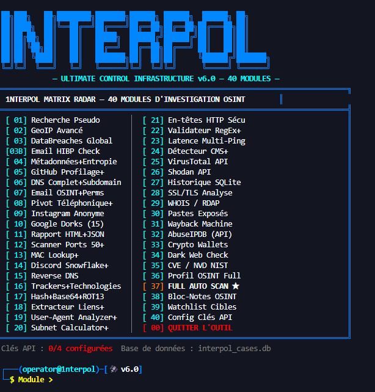

# 🌐 1NTERPOL MATRIX RADAR | Advanced Cyber-Detector Framework

<p align="center">
  
  
  
</p>

<p align="center">
  
</p>

---

## 📖 Introduction

**1NTERPOL Matrix Radar** est une plateforme modulaire d’investigation numérique conçue pour automatiser les tâches de reconnaissance (Recon), d’analyse réseau et d’audit de sécurité.

Développé entièrement en **Python pur**, ce framework fournit une infrastructure légère, rapide et extensible sans dépendances externes.

Le moteur combine :
- OSINT
- Analyse réseau
- Investigation digitale
- Corrélation de données
- Surveillance de cibles
- Audit de sécurité

---

# 🚀 Fonctionnalités

## 🔍 Reconnaissance Réseau

- Banner Grabbing avancé
- Scan de ports multithreadé
- Détection de services
- Analyse de latence
- Reverse DNS
- Fingerprinting technologies
- Analyse SSL/TLS
- WHOIS / RDAP

---

## 🛡️ Audit & Sécurité

- Vérification headers HTTP
- Détection CMS
- Analyse SPF / DMARC / MX
- Détection de mauvaises configurations
- Intégration VirusTotal
- Intégration Shodan
- Vérification CVE / NIST

---

## 🌐 Modules OSINT

- Recherche pseudo
- Data breaches
- HIBP Check
- Analyse réseaux sociaux
- Wayback Machine
- Pastes exposés
- Crypto wallets
- Dark web check

---

## 📊 Investigation

- Base SQLite intégrée
- Logs horodatés
- Export de rapports
- Watchlist cibles
- Notes d’investigation
- Profil OSINT complet

---

# 🛠️ Architecture

Le moteur **The Architect v6.0** est structuré autour de plusieurs composants :

| Module | Description |
|---|---|
| `CyberTools` | Gestion des données et APIs |
| `Scanner` | Analyse réseau et sécurité |
| `MenuHandler` | Interface CLI |
| `Database Engine` | Archivage SQLite |
| `Recon Engine` | Modules OSINT |


---

# ⚙️ Installation

## 📌 Prérequis

- Python 3.8+
- Linux / Windows / macOS
- Aucune dépendance externe

---

## 🚀 Setup

```bash
# Cloner le dépôt
git clone https://github.com/ton-user/interpol-matrix-radar.git

# Entrer dans le dossier
cd interpol-matrix-radar

# Lancer le framework
python main.py


[01] Recherche Pseudo
[02] GeoIP Avancé
[03] DataBreaches Global
[04] Email HIBP Check
[05] Métadonnées + Entropie
[06] DNS Complet + Subdomain
[07] Email OSINT
[08] Pivot Téléphonique
[09] Instagram Anonyme
[10] Google Dorks
[11] Rapport HTML/JSON
[12] Scanner Ports 50+
[13] MAC Lookup
[14] Discord Snowflake
[15] Reverse DNS
[16] Tracker Technologies
[17] HashBase64 + ROT13
[18] Extracteur Liens
[19] User-Agent Analyzer
[20] Subnet Calculator
[21] En-têtes HTTP Sécurité
[22] Validateur RegEx+
[23] Latence Multi-Ping
[24] Détecteur CMS+
[25] VirusTotal API
[26] Shodan API
[27] Historique SQLite
[28] SSL/TLS Analyse
[29] WHOIS / RDAP
[30] Pastes Exposés
[31] Wayback Machine
[32] AbuseIPDB
[33] Crypto Wallets
[34] Dark Web Check
[35] CVE / NVD NIST
[36] Profil OSINT Full
[37] FULL AUTO SCAN
[38] Bloc-Notes OSINT
[39] Watchlist Cibles
[40] Config Clés API
